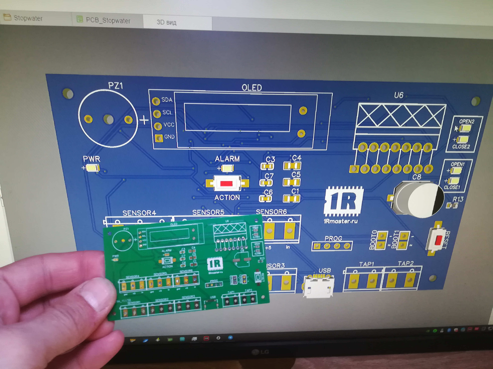

### Автоматическая система отключения воды при утечке / Arduino, STM32  

#### Описание проекта  
Это простое и надежное устройство предназначено для автоматического перекрытия водопровода при утечке воды. Основано на микроконтроллере STM32 и разработано для личного использования, но может быть полезно и другим. Код написан на C++, схема разработана в EasyEDA.  

Критика и доработки приветствуются, но учтите – я не профессиональный разработчик.  

#### Функциональность  
Управление сведено к одной кнопке для максимальной простоты:  
- При утечке воды – система обнаружит изменение сопротивления на датчике, автоматически поочередно закроет краны, выведет информацию на дисплей, включит звуковой сигнал и заблокирует дальнейшие изменения состояния.  
- Отключение аварийного сигнала – однократное нажатие кнопки.  
- Открытие кранов после аварии – повторное нажатие кнопки. Если датчики продолжают фиксировать воду, устройство снова заблокирует краны.  
- Ручное управление – нажатие кнопки в неаварийном режиме открывает или закрывает краны в зависимости от текущего состояния.  

Внешний вид устройства:

Комплектация и ссылки для покупки элементов (основное):
1. [Программатор ST-Link](https://aliexpress.ru/item/32792513237.html?spm=a2g0o.order_list.order_list_main.611.5f1218029YgoDx&gatewayAdapt=glo2rus&sku_id=10000015042616724)
2. [Кран DN15, DC5v, CR01](https://aliexpress.ru/item/32821745380.html?spm=a2g0o.order_list.order_list_main.551.5f1218029YgoDx&gatewayAdapt=glo2rus&sku_id=64817703153)
3. [Драйвер двигателей L298N](https://aliexpress.ru/item/1005001621936295.html?spm=a2g0o.order_list.order_list_main.546.5f1218029YgoDx&gatewayAdapt=glo2rus&sku_id=12000016846765674)
4. [Датчик воды простой](https://aliexpress.ru/item/1005002741992952.html?spm=a2g0o.order_list.order_list_main.541.5f1218029YgoDx&gatewayAdapt=glo2rus&sku_id=12000021933922893)
5. [Кнопки с резиновой втулкой](https://aliexpress.ru/item/32673733924.html?spm=a2g0o.order_list.order_list_main.401.5f1218029YgoDx&gatewayAdapt=glo2rus&sku_id=60207872197)
6. [Провод для протяжки датчиков](https://aliexpress.ru/item/1005001568848822.html?spm=a2g0o.order_list.order_list_main.11.5f1218029YgoDx&gatewayAdapt=glo2rus&sku_id=12000030369248110)
7. [Клеймы](https://aliexpress.ru/item/1005003556955422.html?spm=a2g0o.order_list.order_list_main.76.5f1218029YgoDx&gatewayAdapt=glo2rus&sku_id=12000026274837539)
8. [STM32F103C8T6](https://aliexpress.ru/item/1005003038641885.html?spm=a2g0o.order_list.order_list_main.141.5f1218029YgoDx&gatewayAdapt=glo2rus&sku_id=12000023380646279)
9. [OLED экран SSD136](https://aliexpress.ru/item/1005004224962425.html?spm=a2g0o.order_list.order_list_main.136.5f1218029YgoDx&gatewayAdapt=glo2rus&sku_id=12000028455423552)
    
[Схема и исходники для easyeda](easyeda_com-water-shut-off.zip)

#### Возможные улучшения  
- Тестовый режим на случай закисания кранов – в первой версии был предусмотрен, но пока убран.  
- Беспроводные датчики – для удобства расположения по дому.  
- Оповещение в Telegram – для уведомлений о срабатывании.  
- Автономное питание – возможен вариант работы от батареи, хотя есть вопросы по необходимости.  

Это рабочий, но базовый прототип. Направлений для развития много, если есть идеи – предлагайте! 🚀

Небольшое видео работы устройства и мои колхозные рассуждения:

